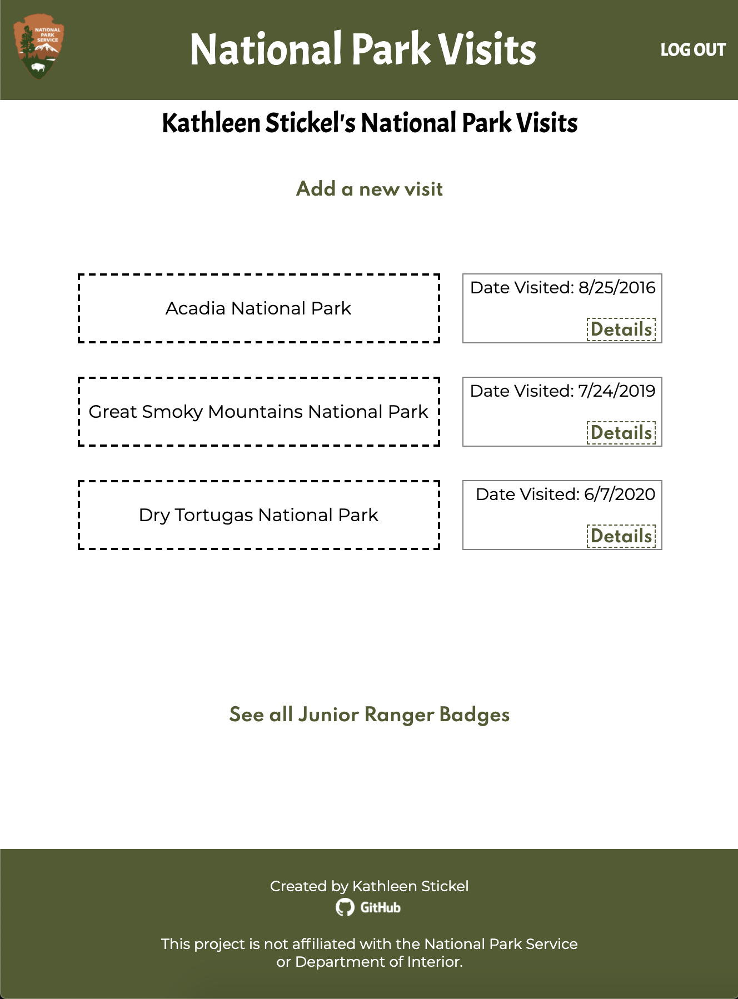

# National Park Visits
This app is a place to keep track of which National Parks you have visted and the Junior Ranger badges you collect along the way.

# Screenshots

# Technologies Used
- HTML/EJS
- CSS
- JavaScript
- Express
- mongoDB/Mongoose

# Getting Started
[Trello Board](https://trello.com/b/J6GvXYVN/project-2-nps-visits-tracker)

[Click here to launch the app](https://nps-visits.herokuapp.com/)

# Next Steps
- Implement the National Park Service API to expand list of parks and include additional data about each park
- Add new views to show the vists of others users
- Include functionality to add reviews to park visits
- Create a "wishlist" feature in which users can create a list of parks they would like to visit
- Expand vists model to include activities such as hiking, camping, and guided tours
